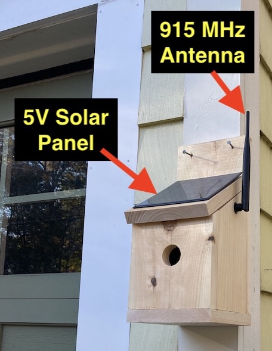
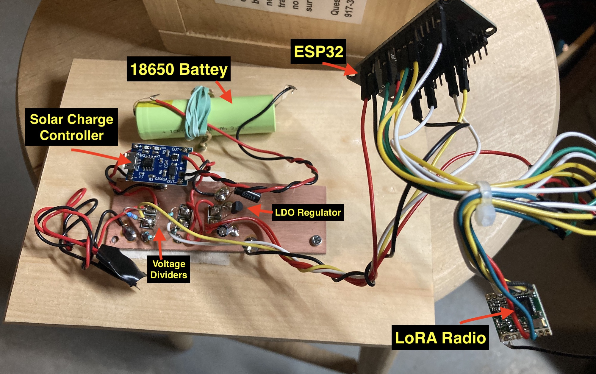
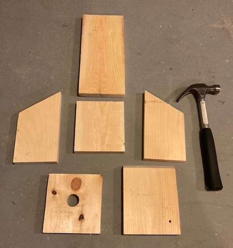
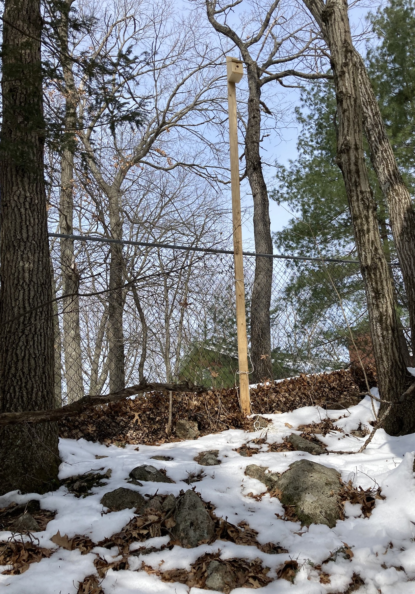
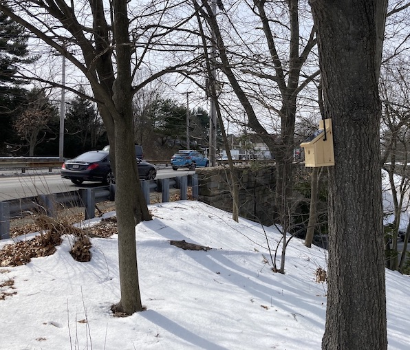
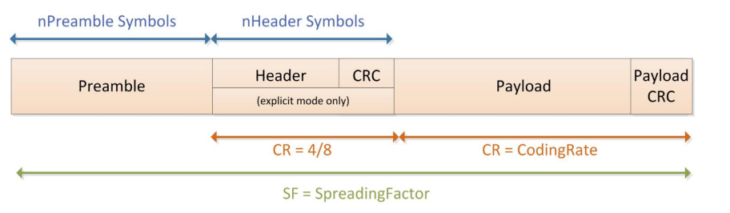
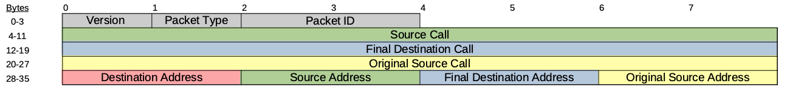

WARS LoRa Birdhouse Project
===========================

This project explores the potential of using low-cost/low-bandwidth LoRa radios to build simple mesh networks that can pass text messages around town.  This project is being undertaken by members of the Wellesley Amateur Radio Society.

Nodes on the network are autonomous, solar-powered birdhouses that each contain a 100mW radio (Semtech SX1276).  These birdhouses can run 24x7 assuming reasonable weather conditions.  USB-connected desktop nodes are used to access the network from a computer.  An internet gateway node is also under development. 

Birdhouse packaging was chosen in order to blend into the surroundings more easily. 

Low-power, solar design allows the birdhouses to be 100% autonomous.  This makes it relatively easy to install a repeater station in any location that has good sun exposure and good visibility to other stations. 

The birdhouse is run by an ESP32 microcontroller at the moment, although this decision is under  consideration.  A more power-efficient STM32 prototype is being worked on.

Commodity components are being used to keep birdhouse costs to a minimum.  Our goal is to keep the node cost under $50 USD. 

The software supports a simple message routing protocol that allows packets to "hop" between houses to reach their final destination.

The 33cm ham band (902-928 MHz) is used given that this is an experimental technology.  All 
nodes must be installed/operated by FCC licensed amateur/ham radio operators.  

A prototype network of 5 stations has been constructed in Wellesley, MA.  Messages have been successfully routed back and forth across the entire mesh, including hops between birdhouses that were separated by approximately 1 kilometer.  Antenna height is important.  The houses have been subjected to bad weather conditions.  

Related Technology
==================

* AREDN (Amateur Radio Emergency Mesh Network): A cool
system that leverages WIFI technology to create off-grid
IP networks that support emergency communications.  The WARS Birdhouse project uses a different wireless technology and is not interoperable with the ARDEN system. ARDEN is designed for much higher bandwidth.  See https://www.arednmesh.org. 
* LoRaWAN: A cool system that uses LoRa stations organized in a star topology.  The hub of each star is a gateway to the public internet.  This technology uses encryption and is not 
legal for amateur projects. 

Hardware Overview
=================

The birdhouse repeater prototype (external view):

The birdhouse repeater prototype (internal electronics view):

The wood parts for the birdhouse repeater prototype:

A tower-mounted birdhouse repeater prototype at the QTH of KC1FSZ:

A tree-mounted repeater prototype installed in a tree inside of a cloverleaf on-/off-ramp:

Hardware Notes
--------------
* Voltage readings are taken on solar panels and batteries.

Software Overview
=================

The LoRa software is completely homebrew - no off-the-shelf drivers are being used.  

All nodes support a serial interface for interacting with the network, but this is only connected for desktop nodes.  

The serial command processor is implemented using this [very good project](https://github.com/philj404/SimpleSerialShell).

A static routing mechanism is being used at the moment.  The routing table for each node can be changed remotely.  Dynamic routing will be developed in a future phase.

Protocol Notes
==============

The LoRa message format is documented here in compliance with FCC regulations.  There is no encryption 
used anywere in the design.  The information contained here is all that is required to interpret the 
messages.

The standardLoRa physical packet format is used.  Particulars:

* 125k bandwidth
* 4/5 coding rate
* Explicit header mode is used
* LoRa spreading factor 9
* CRC enabled

Here is a summary of the physical layer packet format from the Semtech documentation:

The payload above contains a 36-byte header followed by the packet format.  Particulars:

* 36-byte fixed size 
* Version is 2 (at the moment)
* Packet ID is used for acknowledgement and duplicaiton elimination.  16-bit integer (little endian)
* Call signs are in ASCII format, padded with spaces as needed
* Source/destination addresses are 16-bit integer (little endian).  More on addresses below.

Reference Material
==================

* LoRa rules, regulations, and terminology: https://lora.readthedocs.io/en/latest/#rules-and-regulations
* Reference for LoRa radio module (RFM95W): https://www.hoperf.com/modules/lora/RFM95.html
* Reference for 18650 battery: https://cdn.sparkfun.com/datasheets/Prototyping/ICR18650%202600mAH%20datasheet.pdf
* Reference for LDO Voltage Regulator: https://ww1.microchip.com/downloads/en/DeviceDoc/MCP1700-Low-Quiescent-Current-LDO-20001826E.pdf
* Reference for STM32L031 microcontroller: https://www.st.com/resource/en/datasheet/stm32l031k6.pdf
* STM32L0 hardware design guide: https://www.st.com/resource/en/application_note/an4467-getting-started-with-stm32l0xx-hardware-development-stmicroelectronics.pdf
* Reference for the ESP32 D1 Mini: https://wiki.csgalileo.org/_media/projects/internetofthings/d1_mini_esp32_-_pinout.pdf
* An article on correcting non-linearity in the ESP32 AD converter: https://github.com/e-tinkers/esp32-adc-calibrate

Detailed Parts List
-------------------
(To follow)

Areas for Further Experimentation
=================================

Hardware 2.0 (In Process)
-------------------------
* Fully integrated PCB using surface mount components
* Switch to a ultra-low-power microprocessor: STM32L031
* SMA connector for more robust antenna experimentation

Hardware (Future)
-----------------
* Replace the linear regulator with a boost converter to improve battery usage.
* Complete the packaging of the birdhouse to ensure weatherproofing and full compatibility with avian residency.
* Improved power efficiency using smaller microcontrollers.
* Cheaper antennas.
* Gain antennas for longer distance links.
* RF switch to allow dynamic switching between two antennas.  This might facilitate A/B testing, or possibly stations that have a directional/gain antenna for trunking and an omni-directional antenna for local access.
* A custom PCB to simplify construction for club builds.

Software
--------
* Improved power efficiency using more aggressive sleeping.  Leverage the SX1276 receive interrupt or channel activity detection (CAD) interrupt to allow the system to sleep during periods of inactivity.
* Dynamic route discovery. At the moment the routes are static, but they can be modified over-the-air.
* Store and forward for times when a node is offline.
* Message sequence to avoid duplicate delivery.
* Network time synchronization.
* A more user-friendly desktop application written in Python.  This will make it easer for casual users of the work.
end-users to interact with the network.
* Network security.
* Over-the-air (OTA) software upgrades.

Development Notes
=================

One-Time Build Setup (Arduino IDE, Windows)
-------------------------------------------

Make sure you have the latest Arduino IDE installed.  All testing has been
done using version 1.8.19.  Raising build problems when running older 
versions of the IDE is strongly discouraged.

Make sure you have the Git client installed on your computer.  This will 
be needed by anyone who is contributing changes to the code base.  Here is 
the location of a binary install for Git: https://git-scm.com/download/win.

Make sure you have the latest board support for the ESP32 installed in 
your Ardunio IDE using the Boards Manager feature. This page has a good overview: https://docs.espressif.com/projects/arduino-esp32/en/latest/installing.html.  The Additional Board Manager URL is: https://dl.espressif.com/dl/package_esp32_index.json.

Install these two Arduino libraries using the Arduino IDE (Manage Libraries):

* SimpleSerialShell
* arduino-timer

Open a command window and switch into your Arduino sketch directory.  
Typically something like this:

        cd c:\Users\<USER>\Documents\Arduino

Clone the repo for the main sketch from the GitHub:

        git clone https://github.com/brucemack/WARS-Birdhouse.git

Open the sketch in the Arduino IDE.

Make sure these settings are chosen under the Tools menu:
* Board: ESP32 Dev Module
* CPU Frequency: 10MHz
* Port: (Whatever COM port your development board appears as)

Now you should be able to compile.
