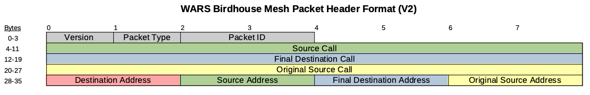

WARS LoRa Birdhouse Project
===========================

Looking for a different way to tweet?  This project explores the potential of using low-cost/low-bandwidth LoRa radios to build simple mesh networks that can pass text messages around town.  Networks of this type could be useful for emergency communications or 
other applications that can take advantage of the fully-autonomous nature of the birdhouse repeater stations. This 
project is being undertaken by members of the Wellesley Amateur Radio Society (W1TKZ, grid FN42).  The design is 
made available for amateur (non-commercial) purposes in the spirit of experimentation and knowledge sharing
amongst the ham community.  At the very least, we're creating homes for some lucky birds in our area.

Please contact Bruce MacKinnon (KC1FSZ) if you have technical questions.  I am 
interested in home-brew radio projects, many of which can be 
found [on my QRZ page](https://www.qrz.com/db/kc1fsz). 

Will this bird fly?  Let's find out!  

Design Overview
================

Nodes on the network are autonomous, solar-powered birdhouses that each contain a +20dBm/100mW radio (Semtech SX1276).  These birdhouses will run 24x7 assuming reasonable weather conditions.  USB-connected desktop nodes are used to access the network from a computer via serial connection.  An internet gateway node is also 
under development. 

LoRa range experiments have been widely documented.  Your milage will vary considerably depending on terrain, 
station hight, etc. Testing shows that 1 km link ranges are reasonable in suburban areas. 

Birdhouse packaging was chosen in order to blend into the surroundings more easily.  

Low-power, solar design allows the birdhouses to be 100% autonomous.  This makes it relatively easy to install a repeater station in any location that has good sun exposure and good visibility to other stations. 

The desktop station model is powered by the USB connection, does not have the battery/solar components, but 
is identical to the birdhouse repeaters from an RF/firmware perspective.

The birdhouse is run by an ESP32 microcontroller at the moment, although this decision is under  consideration.  A more power-efficient STM32 prototype is being worked on.

Commodity components are being used to keep birdhouse costs to a minimum.  Our goal is to keep the node cost under $50 USD. 

The software supports a simple message routing protocol that allows packets to "hop" between houses to reach their final destination.  Other control packets are used to extract engineering data and to control 
message routing.

The 33cm ham band (902-928 MHz) is used given that this is an experimental technology.  All 
nodes must be installed/operated by FCC licensed amateur/ham radio operators.  

A proof-of-concept network of 5 stations has been constructed in Wellesley, MA.  Messages have been successfully routed back and forth across the entire mesh, including hops between birdhouses that were separated by approximately 1 kilometer.  Antenna height is important, as always.  The houses have been subjected to bad New England weather conditions including snow, ice, extended periods of cloudy weather and sub-zero temperatures.  It is an open question as to how the system will perform when our trees have leaves on them again!

A 15 node beta network is currently in the planning stages.  This includes upgrades of the hardware and firmware.

If you are interested in _high-speed_ mesh networks built using commercial hardware this project might not be your thing.  Please take a look at AREDN (https://www.arednmesh.org) instead.  The AREDN team is doing great work.

Architecture Overview
=====================

How Do I Access The Network?
============================

Users access the network using desktop stations that are fitted with a USB serial port.  The desktop station runs exactly the same firmware as the birdhouse repeater.  A serial command protocol is used to send and receive messages on the network.  The desktop stations have all of the required RF components and are full-fledged nodes on the network (with their own addresses).  Desktop nodes don't use the solar/battery installation since they can be powered from the USB port.

Currently users interact with the network using a conventional serial terminal running on a PC (ie. PUTTY or something similar).  No special software is required.  A Python desktop user interface is planned to improve ergonomics.  The serial commands are described in a later section.

The expectation is that users will install a birdhouse station at some 
advantageous location on their property in order to join the network and
increase the network coverage area.  This
means that the required line-of-sight for the desktop station is much less 
important - it's a "short hop" onto  the network.

The other option is to connect the desktop station to a quality antenna 
using a longer feed-line and avoid the need for two stations.  Either configuration 
is fine.

The packaging for the desktop station has not yet been finalized.  At the moment 
the parts are mounted on a block of wood, as pictured below.  A resonant vertical antenna
and USB cable are included with the package.

How Can I Get A Birdhouse?
==========================

Hardware/firmware is still being refined as part of a club project.  All firmware, KiCAD files, and woodworking
dimensions are available on this site for anyone who wants to build a birdhouse for themselves.

After our next hardware iteration (V2) is tested we will be making the components available in kit form.

If you live in a strategic location at high elevation and you would like a fully-assembled, tested station we will be happy to provide one free of charge. :-)

Please contact the network administrator to be assigned a node address on the network.

Do I Need To Be A Ham To Use The Network?
=========================================

Yes. The radio module we are using is not Part 15 certified 
so it must be run using Part 97 (amateur) rules.  We are currently doing research on a non-ham ISM Part 15 version of the network 
to make it easy for non-licensed users to join the fun.  

Per FCC rules, Part 15 and Part 97 networks will not talk to each other.

Protocol Documentation
======================

The network runs on the 33cm (902-928 MHz) amateur band.  We are running on 906.5 MHz, which lies
in the digital portion of the ARRL band plan for 33cm.  According to the New England Spectrum Management Council (NESMC, https://www.nesmc.org/) 902 MHz band plan, this frequency is in the "mixed use" section of the band, and does not need coordination.

The LoRa message format is documented here in compliance with FCC regulations.  There is no encryption 
used anywhere in the design.  The information contained here is all that a listener would need to interpret the messages.

The standard LoRa physical packet format is used.  Particulars on LoRa parameters:

* 125k bandwidth mode
* CRC enabled, 4/5 coding rate
* Explicit header mode is used
* LoRa spreading factor 9
* 12 symbol preamble

Here is a summary of the physical layer packet format from the Semtech documentation:

The payload above contains a 36-byte header followed by a variable length packet format.  Particulars:

* 36-byte fixed size. 
* Version (PV) is 2 (at the moment).
* Packet type (PT) describes the nature/handling of the message.  More on types below.
* Packet ID (PID) is used for acknowledgement and duplicate packet elimination.  16-bit integer (little endian).
* Call signs are in ASCII format, padded with spaces as needed.
* Source/destination addresses are 16-bit integer (little endian).  More on addresses below.

### Station Addressing Scheme

Each station is assigned a 16-bit address. Some addresses have special significance:
* 0x0000: Not used
* 0x0001 through 0xffef: Used for normal stations on the network.
* 0xfff0 through 0xfffd: Un-routed stations used for administrative/maintenance purposes.
* 0xfffe: Gateway station to other meshes
* 0xffff: The broadcast address

### Packet Types

Packet types are interpreted as follows:
* 0: Not used
* 1: General acknowledgement packet, used for reliable delivery.
* 2: Station ID/beacon packet.
* 3: Ping request.
* 4: Ping response (pong).
* 5: Station engineering data request.
* 6: Station engineering data response.  
  * See below for details of response.
* 7: Network path test request.  
  * Stations will add their node ID and last-hop RSSI data to this message as it is routed through the network.
* 8: Network path test response.  
  * Stations will add their node ID and last-hop RSSI data to this message as it is routed through the network.
* 9: Set security seed.  Used to establish the seed used to validate privileged requests.
* 10: Set route request.  (A privileged operation)
* 11: Get route data request.
* 12: Get route data response.
* 13: Discover route request (FUTURE USE).
* 14: Discover route response (FUTURE USE).
* 15: Station reset request. (A privileged operation)
* 16: Set station clock request. (A privileged operation)
* 17: Reset engineering counters request.
* 18: Firmware update request (FUTURE USE, privileged)
* 19-31: (RESERVED)
* 32: Routine text traffic.
  * ASCII, free-text payload.  Variable size, max size is 128 bytes.
* 33: Priority/emergency text traffic.
  * ASCII, free-text payload.  Variable size, max size is 128 bytes.
* 34: Routine binary/data traffic.
  * Variable size, max size is 128 bytes.  *NO ENCRYPTION ALLOWED!*
* 35: Priority/emergency binary/data traffic.
  * Variable size, max size is 128 bytes.  *NO ENCRYPTION ALLOWED!*
* 36: Station alert.  Used for sounding audible alarms, etc.

### Acknowledgement/De-Duplication 

Most packet types are acknowledged on each hop.  Packet type 1 is used for this purpose.  Note that this 
doesn't mean that the acknowledgement reaches the original sender, it just means that each 
station will get an ACK to indicate that a packet has been handed off to the next station in 
the route path.

Acknowledgement packets (type 1) and Station ID packets (type 2) are not acknowledged.

Stations will maintain a counter for each node that is receives packet from.  Duplicate packets
will be discarded based on the Packet ID counter.  A window will be used to avoid confusion when 
the counter wraps.

#### Station Engineering Data Packet

This packet returns technical data that is used to monitor the state of 
a station.  Format is a follows:

* 0-1: Firmware version 
* 2-3: Battery voltage in mV
* 4-5: Panel voltage in mV
* 6-9: Uptime in seconds
* 10-13: Time (in seconds since the epoch)
* 14-15: Boot count
* 16-17: Sleep count 
* 18-19: Receive packet count 
* 20-21: Routing error count
* 22-23: Temperature (when option installed)
* 24-25: Humidity (when option installed)
* 26-27: Device class
  * 0: Unspecified
  * 1: WARS Desktop ESP32
  * 2: WARS Birdhouse ESP32
  * 3: WARS Mesh gateway STM32
  * 4: WARS Internet gateway STM32
  * 5: WARS Desktop STM32
  * 6: WARS Birdhouse STM32
* 28-29: Device revision
* 30-31: Wrong-node receive packet count 

2 byte and 4 byte integers are in little-endian format.

Hardware Overview (Electronics)
===============================

The birdhouse repeater prototype (external view):

The birdhouse repeater prototype (internal electronics view):

A tower-mounted birdhouse repeater prototype at the QTH of KC1FSZ:

Hardware Notes
--------------
* Voltage readings are taken on solar panels and batteries.
* The V2 schematic can be found [here](https://github.com/brucemack/WARS-Birdhouse/blob/main/kicad/WARS%20Birdhouse%20V2.pdf).

Hardware Overview (Woodwork)
============================

Repeater nodes are packaged in a standardized birdhouse enclosure that was designed for easy assembly.  
Six pieces of wood are required.  Components are attached using wood screws.  The birdhouse is fully
functional for small bird species.    

The roof is sloped at a 32 degree angle according to the recommended optimal configuration for 
solar generation at 42 degrees North latitude where the initial network was deployed. The design
may need to be adjusted for other locations.  

The wood parts for the birdhouse repeater prototype:

A tree-mounted repeater prototype installed in a tree inside of a cloverleaf on-/off-ramp:

Cut list:
* 1"x6" nominal stock (5.5" actual)
  * Sides: 8 1/2" length with 32 degree mitre
  * Roof: 7 1/4" length with 32 degree bevel on table saw
* 1"x5" nominal stock (4.5" actual)
  * Back: 12" length
  * Bottom: 6" length
  * Front: 5 1/4" with 32 degree bevel on table saw. Hole 1 1/2" diameter.

**PLEASE USE CAUTION WHEN WORKING WITH POWER TOOLS!**

Software Overview
=================

The LoRa software is completely homebrew - no off-the-shelf drivers are being used.  This
means much more work, and much more learning.

All nodes support a serial interface for interacting with the network, but this is only connected for desktop nodes.  

The serial command processor is implemented using this [very good project](https://github.com/philj404/SimpleSerialShell) by Phil Jensen.

A static routing mechanism is being used at the moment.  The routing table for each node can be changed remotely.  Dynamic routing will be developed in a future phase.

Related Technology
==================

* AREDN (Amateur Radio Emergency Mesh Network): A very cool
system that leverages WIFI technology to create off-grid
IP networks that support emergency communications.  These guys are doing much higher speeds and 
are using much more sophisticated hardware.  The WARS Birdhouse project uses a different 
wireless technology and is not interoperable with the ARDEN system.  See https://www.arednmesh.org. 
* LoRaHAM (https://github.com/travisgoodspeed/loraham): A great open-source project that explored some similar territory.  The project appears to be inactive at this time.
* LoRaWAN: A cool system that uses LoRa stations organized in a star topology.  The hub of each star is a gateway to the public internet.  This technology uses encryption and is not legal for amateur projects. 

Reference Material
==================

* Radio Mobile by VE2DBE: https://www.ve2dbe.com/english1.html is a great program for understanding local-area/LOS propagation. 
* The Ubiquity Link Planner is very helpful for understanding land features between 
potential station sites: https://link.ui.com/#.2q
* LoRa rules, regulations, and terminology: https://lora.readthedocs.io/en/latest/#rules-and-regulations
* Reference for LoRa radio module (RFM95W): https://www.hoperf.com/modules/lora/RFM95.html
* Reference for 18650 battery: https://cdn.sparkfun.com/datasheets/Prototyping/ICR18650%202600mAH%20datasheet.pdf
* Reference for LDO Voltage Regulator: https://ww1.microchip.com/downloads/en/DeviceDoc/MCP1700-Low-Quiescent-Current-LDO-20001826E.pdf
* Reference for STM32L031 microcontroller: https://www.st.com/resource/en/datasheet/stm32l031k6.pdf
* STM32L0 hardware design guide: https://www.st.com/resource/en/application_note/an4467-getting-started-with-stm32l0xx-hardware-development-stmicroelectronics.pdf
* Reference for the ESP32 D1 Mini: https://wiki.csgalileo.org/_media/projects/internetofthings/d1_mini_esp32_-_pinout.pdf
* An article on correcting non-linearity in the ESP32 AD converter: https://github.com/e-tinkers/esp32-adc-calibrate
* Datasheet for the W5500 which is used to create the bridge to an IP network: https://cdn.sparkfun.com/datasheets/Dev/Arduino/Shields/W5500_datasheet_v1.0.2_1.pdf

Detailed Parts List
-------------------
(To follow)

Areas for Further Experimentation
=================================

Hardware 2.0 (In Process)
-------------------------
* Fully integrated PCB using surface mount components
* Switch to a ultra-low-power microprocessor: STM32L031
* SMA connector for more robust antenna experimentation

Hardware (Future)
-----------------
* Replace the linear regulator with a boost converter to improve battery usage.
* Complete the packaging of the birdhouse to ensure weatherproofing and full compatibility with avian residency.
* Cheaper antennas.
* Gain antennas for longer distance links.
* RF switch to allow dynamic switching between two antennas.  This might facilitate A/B testing, or possibly stations that have a directional/gain antenna for trunking and an omni-directional antenna for local access.
* A hand-held station with an LCD RSSI display for scouting potential station locations.

Software
--------
* Improved power efficiency using more aggressive sleeping.  Leverage the SX1276 receive interrupt or channel activity detection (CAD) interrupt to allow the system to sleep during periods of inactivity.
* Dynamic route discovery. At the moment the routes are static, but they can be modified over-the-air.
* Store and forward for times when a node is offline.
* Message sequence to avoid duplicate delivery.
* Network time synchronization.
* A more user-friendly desktop application written in Python.  This will make it easer for casual users of the work.
end-users to interact with the network.
* Network security.
* Over-the-air (OTA) software upgrades.

Development Notes
=================

One-Time Build Setup (Arduino IDE, Windows)
-------------------------------------------

Make sure you have the latest Arduino IDE installed.  All testing has been
done using version 1.8.19.  Raising build problems when running older 
versions of the IDE is strongly discouraged.

Make sure you have the Git client installed on your computer.  This will 
be needed by anyone who is contributing changes to the code base.  Here is 
the location of a binary install for Git: https://git-scm.com/download/win.

Make sure you have the latest board support for the ESP32 installed in 
your Ardunio IDE using the Boards Manager feature. This page has a good overview: https://docs.espressif.com/projects/arduino-esp32/en/latest/installing.html.  The Additional Board Manager URL is: https://dl.espressif.com/dl/package_esp32_index.json.

Install these two Arduino libraries using the Arduino IDE (Manage Libraries):

* SimpleSerialShell
* arduino-timer

Open a command window and switch into your Arduino sketch directory.  
Typically something like this:

        cd c:\Users\<USER>\Documents\Arduino

Clone the repo for the main sketch from the GitHub:

        git clone https://github.com/brucemack/WARS-Birdhouse.git

Open the sketch in the Arduino IDE.

Make sure these settings are chosen under the Tools menu:
* Board: ESP32 Dev Module
* CPU Frequency: 10MHz, WIFI/Bluetooth disabled
* Port: (Whatever COM port your development board appears as)

Now you should be able to compile.

Relevant FCC Regulations
========================

* Part 97.311 Defines spread-spectrum (SS) rules.
* Part 97.303 (N) Defines rules for the 33cm band.  Basically, hams must share the band with other services.  There are also geographical restrictions in Texas, New Mexico, Colorado, and Wyoming.
* Part 97.309 (B) Talks about unspecified data emission codes.  Basically, all formats need to be clearly documented. See above. 
* Are any part 15 regulations relevant here?

Copyright Information 
=====================

Copyright (C) 2022 - Bruce MacKinnon KC1FSZ

This work is covered under the terms of the GNU Public License (V3).  Please consult the 
LICENSE file for more information.  

This work is being made available for non-commercial use by the amateur radio community. Redistribution, commercial use or sale of any part is prohibited.

