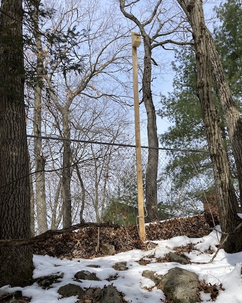

WARS Birdhouse Project
======================

The objective of this project is to explore the potential of using low-cost LoRA radios to build simple mesh networks. 

Hardware Overview
=================

The birdhouse repeater (external view):

The birdhouse repeater (internal view):

A tower-mounted birdhouse repeater at the QTH of KC1FSZ.

A tree-mounted repeater installed in a tree inside of a cloverleaf on-/off-ramp.

Reference Material
==================

* Reference for LoRA module (RFM95W): https://www.hoperf.com/modules/lora/RFM95.html
* Reference for 18650 battery: https://cdn.sparkfun.com/datasheets/Prototyping/ICR18650%202600mAH%20datasheet.pdf
* Reference for LDO Voltage Regulator: https://ww1.microchip.com/downloads/en/DeviceDoc/MCP1700-Low-Quiescent-Current-LDO-20001826E.pdf

Software Overview
=================

